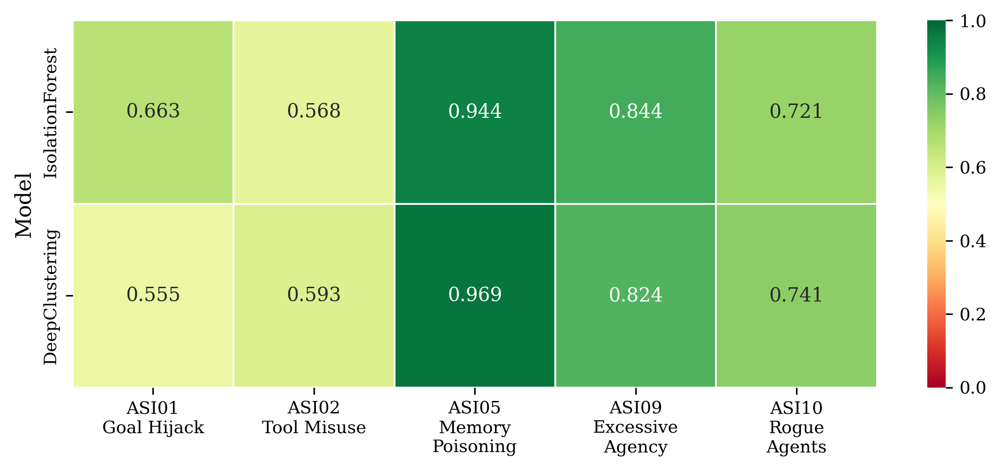
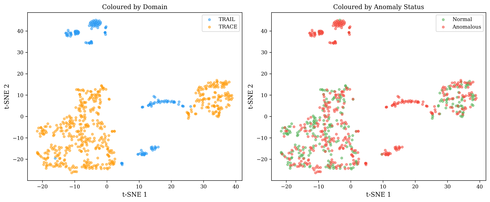

# From Rogue Employees to Rogue Agents

**Repurposing Insider Threat Detection for AI Agent Governance**

Bipin Rimal | February 2026

---

## The Argument

Most people assume insider threat detection and AI agent monitoring are separate disciplines. They share the same architecture.

Both profile a baseline of "normal" behaviour — one for employees, one for agents. Both flag deviations from that baseline as anomalous. Both encode assumptions about trust, authority, and what counts as legitimate action. The detection systems are structurally identical. The governance questions they raise are the same.

This project demonstrates that concretely. I took three anomaly detection models I built for my MSc thesis (Isolation Forest, LSTM Autoencoder, Deep Clustering — validated at 0.985 AUC-ROC on the CMU-CERT insider threat dataset), applied them to AI agent execution traces through a unified feature schema, and mapped the detections to the OWASP Top 10 for Agentic Applications.

The models transfer. Not all of them, and not equally. That's the interesting part.

## What's Here

```
src/
  features/    UBFS schema (20-dim vector bridging both domains)
  models/      Isolation Forest, LSTM Autoencoder, Deep Clustering
  data/        Loaders for TRAIL, TRACE, AgentHarm, CMU-CERT
  evaluation/  Metrics, cross-domain transfer, OWASP mapping
  governance/  Normality assumption audit
```

## The Transfer Mechanism

The core contribution is the **Unified Behavioural Feature Schema (UBFS)** — a 20-dimensional feature space that maps both insider threat indicators and agent trace signals into the same representation:

| Category | Dim | Insider Threat | Agent Trace |
|----------|-----|----------------|-------------|
| Temporal | 4 | Logon hours, session duration, after-hours ratio | Trace start time, span duration, off-schedule ratio |
| Frequency | 4 | Event counts (email, file, device) | Tool call count, LLM calls, error spans |
| Volume | 3 | Data transferred, attachment sizes | Token usage, output artifacts |
| Scope | 3 | Systems accessed, unique recipients | Tools invoked, API endpoints |
| Sequence | 3 | Action entropy, transition patterns | Tool-call entropy, bigram novelty |
| Deviation | 2 | Peer group distance | Agent-type baseline distance |
| Privilege | 1 | Access level deviation | Scope deviation |

Both feature extractors (`cert_extractor.py`, `agent_extractor.py`) output vectors in this space. The anomaly detection models operate on the vectors without knowing which domain they came from.

## Results

### Experiment 1: Within-Domain Baselines

Models trained on normal data, evaluated on the full dataset (5 seeds each).

| Model | TRAIL AUC-ROC | TRACE AUC-ROC | CMU-CERT AUC-ROC |
|-------|:------------:|:-------------:|:----------------:|
| Isolation Forest | 0.577 | 0.500 | **0.731** |
| LSTM Autoencoder | 0.685 | 0.521 | 0.723 |
| Deep Clustering | **0.897** | 0.496 | 0.697 |

TRAIL (agent execution traces with annotated errors) is detectable — Deep Clustering achieves 0.897 AUC-ROC. TRACE (reward hacking in coding agents) is not — all models hover at random chance. This makes sense: reward hacking produces traces that look structurally identical to normal traces. The deviation is semantic, not behavioural. Anomaly detection catches structural deviations, not clever ones.

CMU-CERT through the UBFS lens achieves 0.731 (IF), lower than the MSc thesis's 0.807 with the full 24-feature pipeline. The lossy compression into 20 UBFS dimensions trades detection fidelity for cross-domain portability.

### Experiment 2: Cross-Domain Transfer

The question that matters: does anomaly knowledge transfer across domains?

**Agent-to-Agent Transfer:**

| Direction | Model | Source AUC-ROC | Target AUC-ROC | Drop |
|-----------|-------|:-------------:|:-------------:|:----:|
| TRAIL → TRACE | Isolation Forest | 0.577 | 0.469 | -0.109 |
| TRAIL → TRACE | Deep Clustering | 0.897 | 0.513 | -0.384 |
| TRACE → TRAIL | Isolation Forest | 0.500 | **0.614** | **+0.113** |
| TRACE → TRAIL | Deep Clustering | 0.496 | 0.631 | +0.135 |

**Insider ↔ Agent Transfer (the core contribution):**

| Direction | Model | Source AUC-ROC | Target AUC-ROC | Drop |
|-----------|-------|:-------------:|:-------------:|:----:|
| CERT → TRAIL | Isolation Forest | 0.731 | **0.711** | **-0.019** |
| CERT → TRAIL | Deep Clustering | 0.688 | 0.632 | -0.056 |
| CERT → TRACE | Isolation Forest | 0.731 | 0.501 | -0.230 |
| TRACE → CERT | Deep Clustering | 0.496 | **0.719** | **+0.223** |
| TRAIL → CERT | Deep Clustering | 0.897 | 0.640 | -0.257 |

**The headline result: CERT → TRAIL retains 97% of detection power.** An Isolation Forest trained entirely on insider threat data (329,000 employee user-days) achieves 0.711 AUC-ROC on agent execution traces — a drop of only 0.019 from its within-domain performance. The UBFS bridge works.

The unexpected result: **TRACE → CERT improves Deep Clustering by +0.223.** Training on 249 reward-hacking trajectories produces a richer normal baseline that outperforms within-domain DC on insider detection (0.719 vs 0.697). More training data from *any* domain helps, even across the insider/agent boundary.

CERT → TRACE fails (~0.50) because reward hacking is structurally undetectable regardless of training domain.

### Experiment 3: OWASP Detection Matrix

Synthetic anomalies injected into TRAIL traces, mapped to OWASP ASI categories:



| OWASP Risk | IF AUC-ROC | DC AUC-ROC |
|------------|:----------:|:----------:|
| ASI01 Goal Hijack | 0.663 | 0.555 |
| ASI02 Tool Misuse | 0.568 | 0.593 |
| ASI05 Memory Poisoning | **0.944** | **0.969** |
| ASI09 Excessive Agency | 0.844 | 0.824 |
| ASI10 Rogue Agents | 0.721 | 0.741 |

**Tool Misuse (ASI02) is a blind spot** (0.57-0.59 AUC-ROC). Both models struggle because tool misuse changes parameters without changing structural patterns. The tool is called correctly, with correct sequencing — it just uses escalated privileges. This is the AI equivalent of an employee using their legitimate access to do something illegitimate. Structural anomaly detection can't catch it. You need semantic understanding.

This has direct governance implications: any monitoring system built purely on behavioural patterns will miss the most sophisticated attacks.

### Experiment 4: Governance Assumptions

Every anomaly detection system encodes assumptions about what "normal" means. Six assumptions embedded in the UBFS:

1. **After-hours activity is suspicious.** Penalises shift workers (human) and scheduled agents (AI). In both cases, the assumption privileges one temporal pattern over others.

2. **Peer deviation is suspicious.** Assumes groups should be homogeneous. Flags legitimate variation. The definition of "peer group" encodes organisational hierarchy.

3. **Broad resource access is suspicious.** Privileges specialists over generalists. Cross-functional employees and multi-tool agents are structurally more likely to be flagged.

4. **High volume means risk.** Equates data movement with exfiltration. Doesn't distinguish legitimate large tasks from malicious extraction.

5. **Unpredictable actions are suspicious.** Penalises creative and exploratory behaviour. Rewards routine. The question: do we value conformity over adaptability?

6. **Above-role access is suspicious.** Assumes stable role definitions. In dynamic systems, legitimate scope expansion looks identical to privilege escalation.

The full governance report is at [`results/governance_report.md`](results/governance_report.md).

## Latent Space



The left panel shows TRAIL and TRACE traces in Deep Clustering's latent space, coloured by domain. They cluster separately — the domains have distinct structural signatures despite sharing the same UBFS representation. The right panel colours by anomaly status: anomalous traces scatter across both domains rather than forming their own cluster. Anomalies are defined by deviation from *domain-specific* baselines, not by a universal "anomalous" signature.

## Datasets

| Dataset | Source | Size | Role |
|---------|--------|------|------|
| [TRAIL](https://huggingface.co/datasets/PatronusAI/TRAIL) | Patronus AI | 148 traces, 841 errors | Agent error detection |
| [TRACE](https://huggingface.co/datasets/PatronusAI/trace-dataset) | Patronus AI | 517 trajectories | Reward hack detection |
| [AgentHarm](https://huggingface.co/datasets/ai-safety-institute/AgentHarm) | UK AISI | 440 tasks | Malicious agent behaviour |
| CMU-CERT | Carnegie Mellon SEI | ~1000 users, 500+ days | Insider threat baseline |

## Reproducing

```bash
# Setup
python3.11 -m venv .venv
source .venv/bin/activate
pip install -e ".[dev,notebooks]"

# Run tests (50 unit tests, no external data needed)
pytest tests/ -v

# Login to HuggingFace (TRAIL and TRACE are gated datasets)
huggingface-cli login

# Run all experiments (agent datasets only)
python run_experiments.py --all

# Run with CMU-CERT (requires ../insider-detection/data/r4.2/)
python run_experiments.py --all --cert

# Generate figures
python generate_figures.py
```

Requires: Python 3.11+, PyTorch 2.0+, HuggingFace account (TRAIL/TRACE are gated), ~5GB storage for datasets. For `--cert` mode, requires the MSc thesis `insider-detection/` project as a sibling directory with CMU-CERT r4.2 data.

## Why This Matters

The AI governance field is building agent monitoring systems from scratch. The security field has been building behavioural monitoring systems for decades. The structural analogy between "rogue employee" and "rogue agent" isn't a metaphor — it's an architectural identity. The same models, the same features, the same blind spots.

The blind spots are what matter most. Tool Misuse (ASI02) evades detection because it operates within legitimate structural boundaries. This is precisely how the most damaging insiders operate — they use their real credentials to do things they shouldn't. If we build agent monitoring systems without learning this lesson from security, we'll rediscover it the hard way.

The governance question underneath both: who decides what "normal" means, and what does that decision exclude?

---

*Built on MSc thesis research (insider threat detection, 0.985 AUC-ROC on CMU-CERT r4.2). Extends to AI agent governance via the Unified Behavioural Feature Schema.*

*For: PhD applications, GovAI Research Scholar candidacy, workshop paper submission.*
